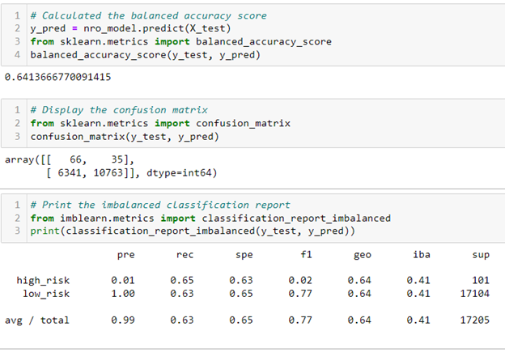
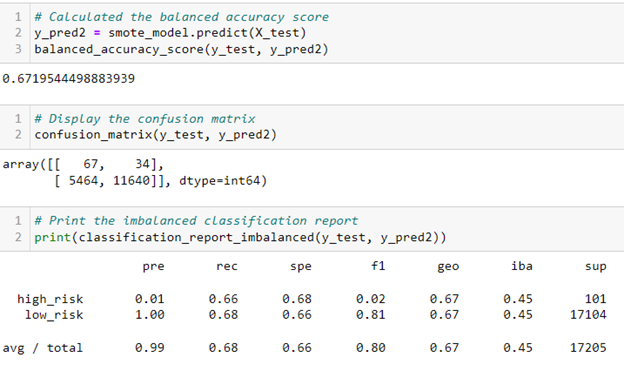
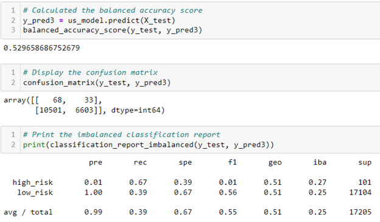
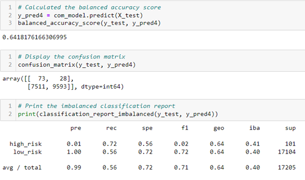
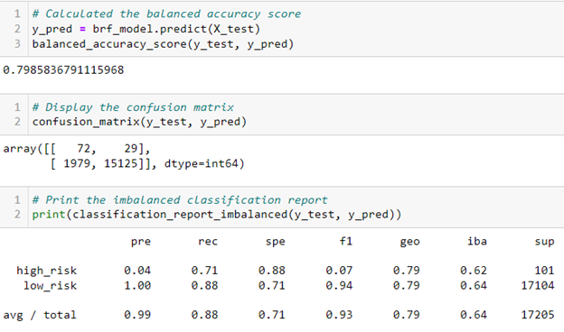
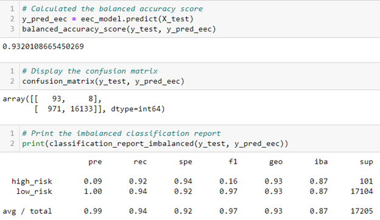

# Credit_Risk_Analysis
Use Python to build and evaluate several machine learning models to predict credit risk.

## Overview

Credit risk is an inherently unbalanced classification problem, as good loans easily outnumber risky loans. For this project, we will employ different techniques to train and evaluate models with unbalanced classes using imbalanced-learn and scikit-learn libraries to build and evaluate models using resampling. Using the credit card credit dataset from LendingClub, a peer-to-peer lending services company we are going to do the following strategies to help us predict credit risk: 

- Oversample the data using the RandomOverSampler and SMOTE algorithms
- Undersample the data using the ClusterCentroids algorithm
- Use a combinatorial approach of over- and undersampling using the SMOTEENN algorithm
- Compare two additional machine learning models that reduce bias, BalancedRandomForestClassifier and EasyEnsembleClassifier

Using each of the techniques, we will then evaluate the performance of each model and make recommendations on whether any of these models can be used to predict credit risk.

## Results
### MODEL 1: Naive Random Oversampling

  
  

Fig.1 - Naive Random Oversampling Model Output

- The balanced accuracy score of .64 this tells us that the overall accuracy of this algorithm on this data set is 64%.
- The precision for high risk applicants is 0.01 which tells us this model had very few true positive results for high risk applicants.
- The precision for low risk applicants is 1 which tells us that this model had 100% accuracy in determining true positives for low risk applicants. (Most likely due to the high number of low risk applicants used from the data - 17,104).
- The recall for high risk applicants is .65 which means 65% of the 101 high risk applicants where found to be high risk.
- The recall for low risk applicants is .63 which means 63% of the 17,104 low risk applicants where found to be low risk.

### MODEL 2: SMOTE Oversampling 

  
  

Fig.2 - SMOTE Oversampling Model Output

- The balanced accuracy score of .67. This tells us that the overall accuracy of this algorithm on this data set is 67%, which is higher than our accuracy using Naive Random Oversampling.
- The precision for high risk applicants is 0.01 which tells us this model had very few true positive results for high risk applicants.
- The precision for low risk applicants is 1 which tells us that this model had 100% accuracy in determining true positives for low risk applicants. (Again, most likely due to the high number of low risk applicants used from the data - 17,104).
- The recall for high risk applicants is .66 which means 66% of the 101 predicted high risk applicants where found to be high risk.
- The recall for low risk applicants is .68 which means 68% of the 17,104 predicted low risk applicants where found to be low risk.

### MODEL 3: Undersampling 

  
  

Fig.3 - Undersampling Model Output

- The balanced accuracy score of .53. This tells us that the overall accuracy of this algorithm on this data set is 53%, which is the lowest accuracy of all of our models.
- The precision for high risk applicants is 0.01 which tells us this model had very few true positive results for high risk applicants.
- The precision for low risk applicants is 1 which tells us that this model had 100% accuracy in determining true positives for low risk applicants. (Again, most likely due to the high number of low risk applicants used from the data - 17,104).
- The recall for high risk applicants in .67 which means 67% of predicted the high risk applicants where found to be high risk.
- The recall for low risk applicants in .39 which means 39% of the predicted low risk applicants where found to be low risk.

### MODEL 4: Combination (Over and Under) Sampling 

  
  

Fig.4 - Combination Sampling (SMOTEENN) Model Output

- The balanced accuracy score of .64. This tells us that the overall accuracy of this algorithm on this data set is 64%
- The precision for high risk applicants is 0.01 which tells us this model had very few true positive results for high risk applicants
- The precision for low risk applicants is 1 which tells us that this model had 100% accuracy in determining true positives for low risk applicants (same high number of low risk appicants).
- The recall for high risk applicants in .72 which means 72% of the predicted high risk applicants where found to be high risk.
- The recall for low risk applicants in .56 which means 56% of the predicted low risk applicants where found to be low risk.

### MODEL 5: Balanced Random Forest Classifier 

  
  

Fig.5 - Balanced Random Forest Classifer Model Output

- The balanced accuracy score of .80. This tells us that the overall accuracy of this algorithm on this data set is 80%, which is the second highest accuracy of all of our models. 
- The precision for high risk applicants is 0.04, which still tells us this model had very few true positive results for high risk applicants
- The precision for low risk applicants is 1.00 which tells us that this model had 100% accuracy in determining true positives for low risk applicants (again, most likely due to the high number of low risk applicants).
- The recall for high risk applicants in .71 which means 71% of the predicted high risk applicants where found to be high risk.
- The recall for low risk applicants in .88 which means 88% of the predicted low risk applicants where found to be low risk.

### MODEL 6: Easy Ensemble AdaBoost Classifier 

  
  

Fig.6 - Easy Ensemble AdaBoost Classifer Model Output

- The balanced accuracy score of .93. This tells us that the overall accuracy of this algorithm on this data set is 93%, which is the highest accuracy of all of our models.
- The precision for high risk applicants is 0.09 which tells us this model still had very few true positive results for high risk applicants.
- The precision for low risk applicants is 1 which tells us that this model had 100% accuracy in determining true positives for low risk applicants (again, most likely due to the high number of low risk applicants).
- The recall for high risk applicants in .92 which means 92% of the high risk applicants where found to be high risk.
- The recall for low risk applicants in .94 which means 94% of the low risk applicants where found to be low risk.

## Summary
Based on the above analysis of each model, I would recommend using the Easy Ensemble AdaBoost Classifier algorithm because:

- It has the highest accuracy score (93%) of all of the models we used to help us predict credit risk.
- It has the highest sensitivity of detecting true high risks (0.92 = 92%); Which means only 8 cases of the 101 applicants with high risks were not detected using this model.
- It has the highest sensitivity for low risk (0.94 = 94%); Which means only 971 cases of 17104 were detected as high risk while in fact they are low risk.
